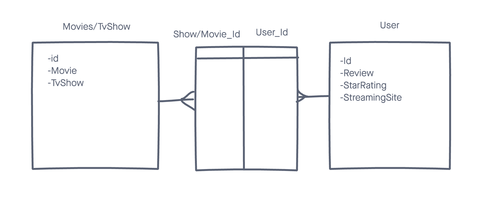
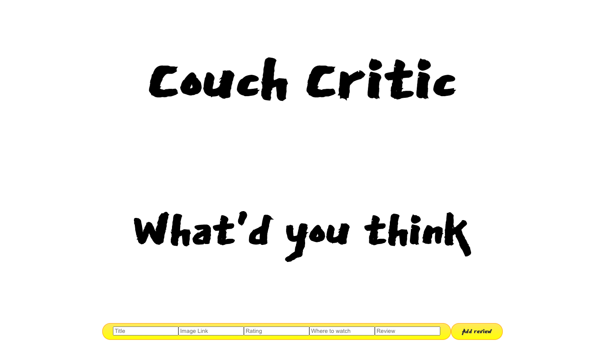
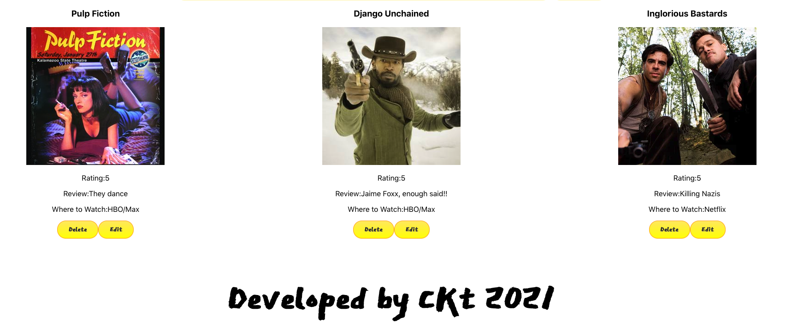

# Couch Critic

Couch Critic is an app to for users to submit their own personal reviews of movies and tv shows.

## Technologies Used 

- Ruby on Rails
- PostgreSQL 13
- Heorku

## Trello Board for PM 

[Click here](https://trello.com/b/BSdnyZ9u/couch-critic) to view Trello Board for Couch Critic 

## ERD

## Couch Critic Screenshots

## Backend Deployment
[Click here](https://couch-critic-api.herokuapp.com/) to see deployed backend